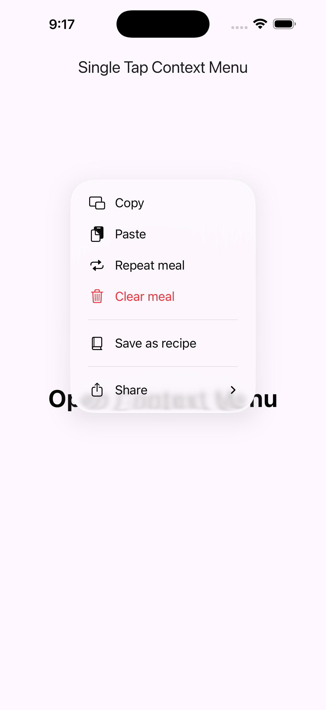
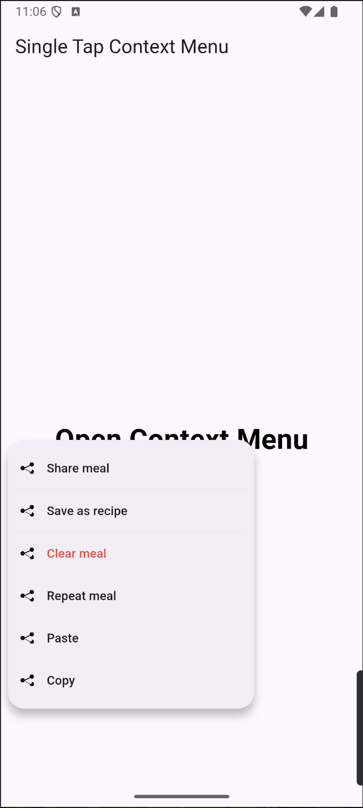

# ios_adaptive_context_menu

Flutter plugin for showing the native iOS context menu on single tap.

## Features

- Opens the iOS system context menu with a single tap.
- Supports actions, dividers, and nested submenus.
- Supports SF Symbols (`iconSystemName`) and SVG asset icons (`iconAssetPath`).
- iOS-first behavior: on non-iOS platforms, the child is rendered as-is.

## Requirements

- Flutter `>=3.13.0`
- iOS `14.0+`

## Installation

```yaml
dependencies:
  ios_adaptive_context_menu: ^0.1.0
```

## Run Example App

```bash
cd example
flutter pub get
flutter run -d ios
```

## Usage

```dart
import 'package:flutter/material.dart';
import 'package:ios_adaptive_context_menu/ios_adaptive_context_menu.dart';

class DemoMenuButton extends StatelessWidget {
  const DemoMenuButton({super.key});

  @override
  Widget build(BuildContext context) {
    return IosSingleTapContextMenu(
      actions: const [
        IosContextMenuAction(
          id: 'share',
          title: 'Share',
          iconSystemName: 'square.and.arrow.up',
        ),
        IosContextMenuDivider(),
        IosContextMenuAction(
          id: 'delete',
          title: 'Delete',
          iconSystemName: 'trash',
          destructive: true,
        ),
      ],
      onSelected: (id) {
        debugPrint('Selected action: $id');
      },
      child: const ListTile(
        title: Text('Tap me'),
        subtitle: Text('Shows iOS native context menu'),
      ),
    );
  }
}
```

## API

- `IosSingleTapContextMenu`
- `IosContextMenuAction`
- `IosContextMenuDivider`
- `IosContextMenuSubmenu`

## Why this approach is stable in Flutter UI

When UIKit content is kept permanently embedded in the Flutter view hierarchy, it can cause rendering and interaction issues in some layouts.

This package avoids that by using an on-demand native bridge:

- The user taps a Flutter widget.
- The tap is forwarded to native iOS code.
- Native creates a temporary invisible UIKit anchor (`UIButton`) only for menu presentation.
- The system context menu is shown from that temporary anchor.
- The anchor is cleaned up after selection/dismissal (and also on widget dispose).

Because no persistent UIKit view is mounted inside Flutter for normal rendering, this approach prevents common Flutter UI breakage caused by long-lived UIKit embedding.

## Screenshots

| iOS | Android |
| --- | --- |
|  |  |
